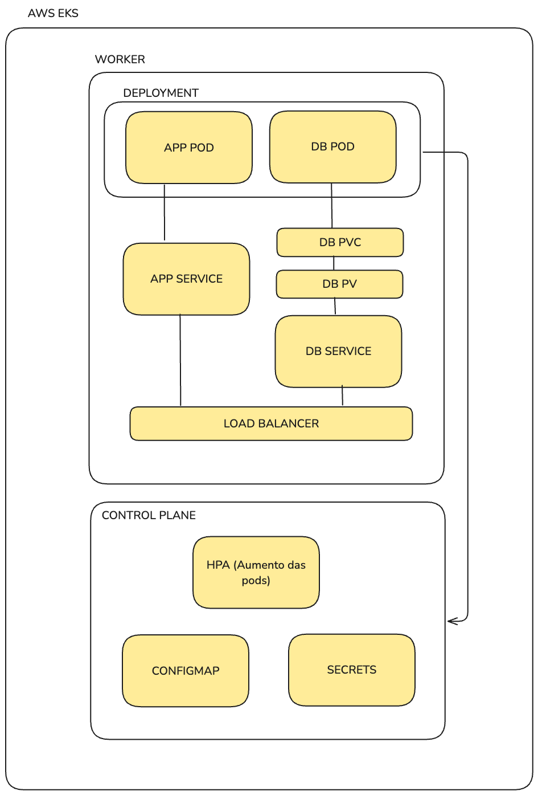
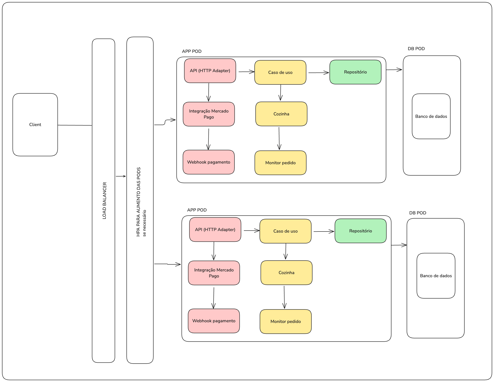

# Order Management System

This project is a backend application designed to manage orders and facilitate efficient customer service as the business expands. Using **FastAPI** with a **hexagonal architecture**, the application allows customers to place and track orders and allows administrators to manage products, customers, and orders. It’s built as a monolithic application with a **PostgreSQL** database, containerized for easy deployment using **Docker** and **Docker Compose**.

## Table of Contents
- [Overview](#overview)
- [Features](#features)
- [Architecture](#architecture)
- [Setup and Installation](#setup-and-installation)
- [Environment Variables](#environment-variables)
- [API Endpoints](#api-endpoints)

## Overview
This application streamlines the ordering process by:
- Allowing customers to place, pay, and track orders through a self-service system.
- Enabling admins to manage the menu and track orders.

## Features
- **Customer Functionality**:
  - Place orders for a main item, side, drink, and dessert.
- **Admin Functionality**:
  - Manage customers.
  - Add, edit, and remove products.
  - Monitor all ongoing orders.

## Architecture
This project follows a **hexagonal architecture** (also known as ports and adapters), with a clear separation of concerns:
- **Core**: Contains domain models and interfaces.
- **Application**: Contains use cases for business logic.
- **Adapters**: Handles API and database interaction.


## Setup and Installation

1. **Clone the repository**:
    ```bash
    git clone git@github.com:rtician/fiap-tech-challenge.git
    cd fiap-tech-challenge
    ```

2. **Install Docker and Docker Compose** if you haven’t already:
    - [Docker](https://docs.docker.com/get-docker/)
    - [Docker Compose](https://docs.docker.com/compose/install/)

3. **Build and run the application** using Docker Compose:
    ```bash
    docker-compose up --build -d
    ```

4. **Apply database migrations**:
    ```bash
   make apply-migrations
   ```
## Setup and Installation using Kubernetes

1. **Clone the repository**:
    ```bash
    git clone git@github.com:rtician/fiap-tech-challenge.git
    cd fiap-tech-challenge
    ```
2. **Install Docker and Docker Compose** if you haven’t already:
    - [Docker](https://docs.docker.com/get-docker/)
    - [Docker Compose](https://docs.docker.com/compose/install/)
    - Enable kubernetes in DOCKER settings

3. **Build and run the application** using Kubernetes:
   ```bash
    kubectl apply -f ./kubernets/secrets.yaml
    kubectl apply -f ./kubernets/configmap.yaml
    kubectl apply -f ./kubernets/db-pv.yaml
    kubectl apply -f ./kubernets/db-pvc.yaml
    kubectl apply -f ./kubernets/db-svc.yaml
    kubectl apply -f ./kubernets/db-deployment.yaml
    kubectl apply -f ./kubernets/app-svc.yaml
    kubectl apply -f ./kubernets/app-deployment.yaml
    kubectl apply -f ./kubernets/hpa.yaml
   ```

## API Endpoints
(Local) The FastAPI Swagger UI is available at: [http://localhost:8009/docs](http://localhost:8009/docs)

*(AWS) The API Swagger UI is available at:* [http://ad1b15e07460a4028b7557c876167662-1972371784.us-east-2.elb.amazonaws.com/docs#/](http://ad1b15e07460a4028b7557c876167662-1972371784.us-east-2.elb.amazonaws.com/docs#/) - (DISABLE $$)

### Execution Order for API:
Fluxo Principal:

1 - Criar customer (/customers)

2 - Criar produto (/products)

3 - Criar um pedido (/orders/checkout)

4 - Realizar o pagamento (orders/payment-webhook)

5 - Alterar o status do pedido assim que finalizar (/orders/{orders_id}/status)

*Fluxo secundário:*

*Rotas secundárias para realizar consultas e ou alterações de pedidos, produtos e clientes.*

## Videos Explanations Links
Part 1 - [https://www.youtube.com/watch?v=B26AEoMjJgU](https://www.youtube.com/watch?v=B26AEoMjJgU) (Architecture representation)

Part 2 - [https://www.youtube.com/watch?v=ZrnqsGbtpDw](https://www.youtube.com/watch?v=B26AEoMjJgU) (API use)

Part 3 - [https://youtu.be/DgDAjOqwkTc](https://youtu.be/DgDAjOqwkTc) (API use)

## Workflow Representations
### Infra Representation:

### App Representation:

